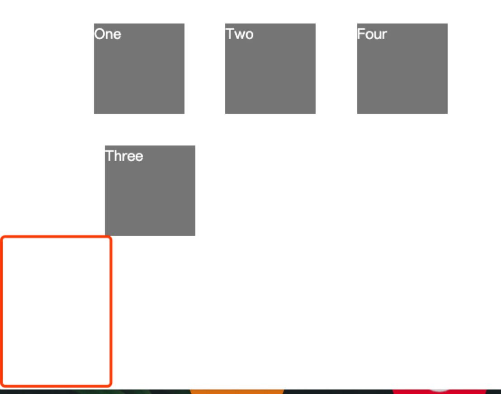
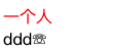
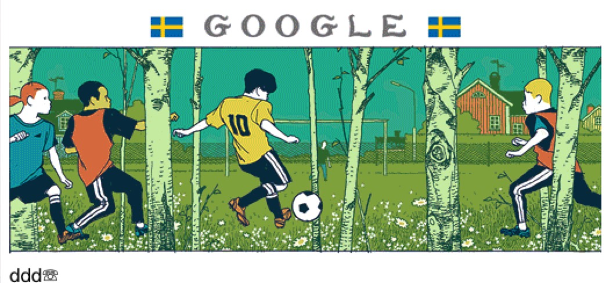
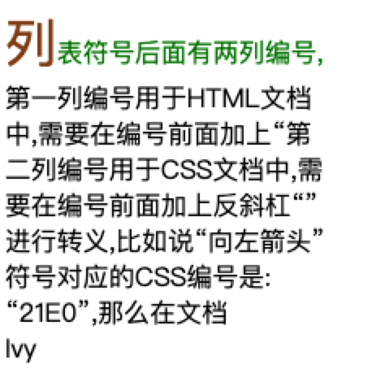

# 十一、你不知道的CSS

## 1、position 属性值及其用法

### static 

position 的默认值，不设定任何定位方式即为该值。此时 top、left、z-index 等各种定位属性不起作用。

### relative

相对定位，设置该值的元素不会脱离文档流，相对于元素本来的位置进行定位。该值对 table-* 一类的元素没有作用。<b>脱离文档流的意思是该元素偏离了位置之后别的元素会占据它原来的空间。</b>

HTML 
```
  <div class="box" id="one">One</div>
  <div class="box" id="two">Two</div>
  <div class="box" id="three">Three</div>
  <div class="box" id="four">Four</div>

```
CSS
```
  .box { 
    display: inline-block; 
    background: red; 
    width: 100px; 
    height: 100px; 
    margin: 20px; 
    color: white; 
  }

  #three { 
    position: relative; 
    top: 10px; 
    left: 50px; 
    z-index: -50;
    width: 100px;
    height: 100px;
  }
```


position的值为 relative 的元素不会脱离文档流，后继元素也不会占据它的位置。

### absolute 

相对于最近一级的且 position 的值不是 static 的祖先元素进行定位。且设置该值的元素会脱离文档流，如果不存在这这样的祖先元素，那么就相对于 <b>body</b> 元素进行定位。

HTML

```
  div class="con">
    <div class="box" id="one">One</div>
    <div class="box" id="two">Two</div>
    <div class="box" id="three">Three</div>
    <div class="box" id="four">Four</div>
  </div>
```
CSS

```
  .con {
    margin-left: 80px;
    position: relative;
  }
  .box { 
    display: inline-block; 
    background: grey; 
    width: 100px; 
    height: 100px; 
    margin: 20px; 
    color: white; 
  }
  #three { 
    position: absolute; 
    top: 100px; 
    left: -100px; 
    z-index: -50;
    width: 100px;
    height: 100px;
  }
```


position 为 absolute 的元素会脱离文档流，其他元素会挤占它的位置。且相对于不是 static 的祖先元素定位。

### fixed

相对于视口进行定位，元素会被移除正常的文档流, 并且随着视口的滚动元素位置也不会发生变化。相对于浏览器窗口定位是不准确的，因为当祖先元素的 transform，perspective 或者 filter 属性非 none 的时候，视口改为祖先。

#### 相对于屏幕视口定位

HTML
```
  <div class="con">
    <div class="box" id="one">One</div>
    <div class="box" id="two">Two</div>
    <div class="box" id="three">Three</div>
    <div class="box" id="four">Four</div>
  </div>
```

CSS
```
  .con {
    margin-left: 80px;
    position: relative;
  }
  .box { 
    display: inline-block; 
    background: grey; 
    width: 100px; 
    height: 100px; 
    margin: 20px; 
    color: white; 
  }
  #three { 
    position: fixed; 
    bottom: 100px; 
    left: 100px; 
    z-index: -50;
    width: 100px;
    height: 100px;
  }
```



随着视口的放大和缩小，红圈圈出来的地方大小是不变的。

#### 相对于父级元素定位

HTML
```
  <div class="con">
    <div class="box" id="one">One</div>
    <div class="box" id="two">Two</div>
    <div class="box" id="three">Three</div>
    <div class="box" id="four">Four</div>
  </div>
```

CSS
```
  .con {
    margin-left: 80px;
    position: relative;
    transform: scale(1);
    border: 1px solid red;
  }
  .box { 
    display: inline-block; 
    background: grey; 
    width: 100px; 
    height: 100px; 
    margin: 20px; 
    color: white; 
  }

  #three { 
    position: fixed; 
    bottom: 100px; 
    left: 100px; 
    z-index: -50;
    width: 100px;
    height: 100px;
  }
```


由于父级元素 transform 属性不为 none，所以 .three 元素相对于父级元素 fixed 定位。图示中黄色区域大小不会发生改变。

### sticky

粘性定位，相对于最近一级的滚动祖先和块级元素进行定位。它会定义一个阈值，在该阈值之内表现为 releative 定位，在这置位之外为固定定位 fixed。

```
  #one { position: sticky; top: 10px; }
```
在 viewport 视口滚动到元素 top 距离小于 10px 之前，元素为相对定位。之后，元素将固定在与顶部距离 10px 的位置，直到 viewport 视口回滚到阈值以下。当其父元素不在视窗内时item元素失去粘性效果。这一点与fixed的表现不同。fixed定位元素是相对于整个视窗定位。

## 2、CSS 盒模型

有两种盒模型，W3C 标准盒模型 content-box， IE 盒模型 border-box。

浏览器默认的是 content-box 标准盒模型。

盒模型包分为内容（content）、填充（padding）、边界（margin）、边框（border）四个部分。

W3C 标准盒模型： 元素设置的 width、height 即为 content 的宽高，不包含 border 和 padding。

IE 盒模型：元素的 width、height 包含 content、padding 和 border。

盒模型可以通过 CSS 的 box-sizing 属性设置。

HTML（默认 W3C 标准盒模型）:
```
  <div class="con"></div>
  .con {
    width: 200px;
    height: 200px;
    background-color: red;
    padding: 20px;
    border: 40px solid brown;
    margin: 30px;
  }
```


标准盒模型 content 的宽高即为设置的 width（200），height(200)

HTML（IE盒模型）:
```
  <div class="con"></div>
  .con {
    width: 200px;
    height: 200px;
    background-color: red;
    padding: 20px;
    border: 40px solid brown;
    margin: 30px;
    box-sizing: border-box;
  }
```


手动设置盒模型为 border-box。元素的宽高即为 content(80) + border(40 * 2) + padding(20 * 2) = width (200)

content的宽高会根据设置的 width 、border、padding 动态设置。

## 3、伪元素和伪类

伪元素和伪类是为了修饰在文档树中不存在的部分。

伪类用于当已有元素处于某个状态时，为其添加对应的样式，这个状态根据用户行为而动态变化。是为了修饰文档树中已有元素。

伪元素用于创建 DOM 树中不存在的元素，并为其添加样式。

### 常见伪类

* 状态类
    * :link
    * :visited
    * :hover
    * :active
    * focus

* 表单相关
    * :checked
    * :disabled
    * :required
* 结构化
    * :not
    * :first-child
    * :last-child
    * :nth-of-type

### 常见伪元素

#### ::before && ::after

在元素之前 && 之后创建 DOM 树中并不存在的元素

HTML:
```
  <span class="con">ddd</span>
```
CSS

```
  .con::before {
      content: '一个人';
      display: block;
      color: red;
    }
  .con::after {
    content:'\260F';
    font-size: 16px;
  }
```


效果：



创建的元素无法审查，调试比较麻烦，但是可以减少 HTML 代码，优化结构。

tips: 创建的伪元素默认是 display: inline, 可以通过设置其 display 属性来覆盖它。

#### content 值

1、string（看上个例子）

2、attr 可以获取元素的属性值

HTML:
```
  <span class="con">ddd</span>
```
CSS:

```
  .con::before {
    content: ""attr(class)"";
    display: block;
    color: red;
  }
```
页面会展示 con 注意 attr 要加双引号，表示是动态需要计算的值。同时最外边也要加双引号。

3、空值 "" 一般用于清除浮动。

4、url 可以引用媒体文件（比如图片）

HTML:
```
  <span class="con">ddd</span>
```
CSS:

```
  .con::before {
    content: url("https://www.google.com/logos/doodles/2018/world-cup-2018-day-19-6211393811382272.3-law.gif");
    display: block;
    color: red;
  }
```

效果：



#### ::first-letter/:first-letter ||  ::first-line/:first-line

匹配首字母 || 首行，该元素不在 DOM 树中。

HTML
```
  <div class="con">
    列表符号后面有两列编号,第一列编号用于HTML文档中,需要在编号前面加上“第二列编号用于CSS文档中,需要在编号前面加上反斜杠“”进行转义,比如说“向左箭头”符号对应的CSS编号是:“21E0”,那么在文档
  </div>
```

CSS
```
  .con {
    width: 200px;
  }
  .con::first-letter {
    font-size: 2em;
    color: saddlebrown;
  }
  .con::first-line {
    color: green;
  }
```
效果：



#### ::selection

用于匹配被用户选中或者处于高亮状态的部分。::selection只可以应用于少数的CSS属性：color, background, cursor,和outline。

HTML:
```
  <div class="con">列表符号后面有两列编号</div>
```
CSS:
```
  .con {
    width: 200px;
    font-size: 10px;
  }
  .con::selection {
    font-size: 20px;
    background: hotpink;
  }
```


font-size 并不起作用，只有 background 起作用。

#### ::placeholder

::placeholder 匹配占位符的文本，只有元素设置了 placeholder 属性时，该伪元素才能生效。

HTML:
```
  <input type="email" placeholder="name@domain.com">
```

CSS:
```
  input::-moz-placeholder {
    color: red;
  }
  
  input::-webkit-input-placeholder {
    color: red;
  }
  
  /* IE 10 only */
  input:-ms-input-placeholder {
    color: red;
  }
  
  /* Firefox 18 and below */
  input:-moz-input-placeholder {
    color: red;
  }
```

效果：


## 4、居中布局


1、利用 position 以及负边距实现。以下例子最外层是 body 标签。

利用相对定位，移动元素左上角到父元素中心，然后利用设置负边距移动到父元素的中心。

```
  .box {
    width: 800px;
    height: 300px;
    position: relative;
    background-color: brown;
    left: 50%;
    top: 50%;
    margin: -150px  0 0 -400px;
  }
```

2、思路类似，不过移动到元素中心的时候采用 transform: translate(-50%, -50%),这种方式有一个好处就是无需知道子元素的宽高。

```
  .box {
    position: relative;
    background-color: brown;
    left: 50%;
    top: 50%;
    transform: translate(-50%, -50%);
  }
```

3、利用 flex 布局，只需要设置父级元素的样式。

```
  body {
    display: flex;
    align-items: center;
    justify-content: center;
  }
```

4、利用 text-align 和 vertial-align 实现水平垂直居中。
```
  body {
    background: rgba(0, 0, 0, 0.5);
    text-align: center;
  }
  body::after {
    content: "";
    display: inline-block;
    height: 100%;
    vertical-align: middle;
  }
  .box {
    display: inline-block;
    width: 500px;
    height: 400px;
    background-color: pink;
    white-space: normal;
    vertical-align: middle;
  }

```

## 5、用 CSS 实现一个三角形

HTML:

```
  <body>
    <div class="header"></div>
    <div class="main">
      <div class="left"></div>
      <div class="right"></div>
    </div>
  </body>
```

使用 border 实现

```
  .con {
    width: 0;
    height: 0;
    border-width: 20px;
    border-style: solid;
    border-color: transparent transparent red transparent;
  }
```

## 5、一个满屏品字布局如何设计

利用 float 实现。

```
  * {
    margin: 0;
  }
  body {
    width: 100%;
    height: 100%;
  }
  .header {
    width: 50%;
    height: 50%;
    margin: 0 auto;
    background: greenyellow;
  }
  .left,.right {
    float: left;
    background: red;
    width: 50%;
    height: 50%;
  }
  .right {
    background-color: rosybrown;
  }
```

利用 inile-block 实现

```
   * {
      margin: 0;
    }
    body {
      width: 100%;
      height: 100%;
    }
    .header {
      width: 50%;
      height: 50%;
      margin: 0 auto;
      background: greenyellow;
    }
    .main {
      text-align: center;
    }
    .left,.right {
      display: inline-block;
      background: red;
      width: 49%;
      height: 50%;
    }
    .right {
      background-color: rosybrown;
    }
```
利用绝对定位实现
```
   * {
      margin: 0;
    }
    body {
      width: 100%;
      height: 100%;
    }
    .header {
      width: 50%;
      height: 50%;
      margin: 0 auto;
      background: greenyellow;
    }
    .main {
      position: relative;
      width: 100%;
      height: 50%;
    }
    .left,.right {
      position: absolute;
      width: 50%;
      height: 100%;
    }
    .left {
      left: 0;
      background-color: royalblue;
    }
    .right {
      right: 0;
      background-color: rosybrown;
    }
```

利用 flex 布局实现

```
    * {
        margin: 0;
      }
    body {
      width: 100%;
      height: 100%;
    }
    .header {
      width: 50%;
      height: 50%;
      margin: 0 auto;
      background: greenyellow;
    }
    .main {
      display: flex;
      height: 50%;
    }
    .left,.right {
      width: 50%;
      height: 100%;
    }
    .left {
      left: 0;
      background-color: royalblue;
    }
    .right {
      right: 0;
      background-color: rosybrown;
    }
```

## 5、多列等高布局如何实现

利用 margin-bottom 和 padding-bottom 对冲实现
HTML；

```
  <div class="main">
    <div class="child"></div>
    <div class="child"></div>
    <div class="child"></div>
  </div>
```

```
  .main {
    overflow: hidden;
  }
  .child {
    float: left;
    margin: 0 10px -9999px 0;
    padding-bottom: 9999px;
    width: 200px;
  }
```

利用 table-cell 实现

```
  .child {
    width: 300px;
    display: table-cell;
    padding: 10px;
    background-color: sandybrown;
  }
```

利用 flex 实现

```
  .main {
    display: flex;
  }
```