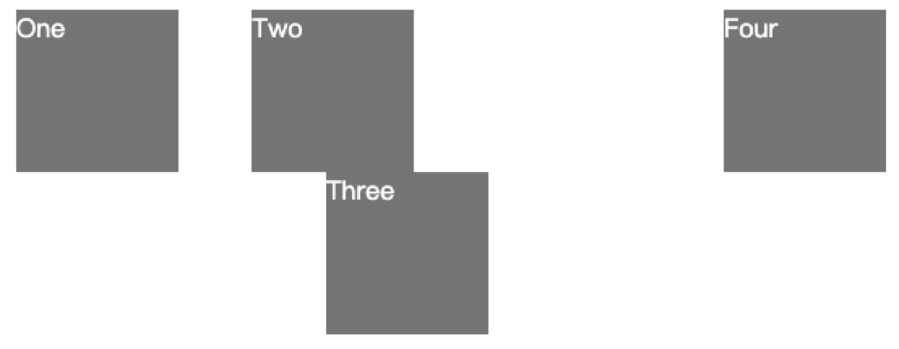
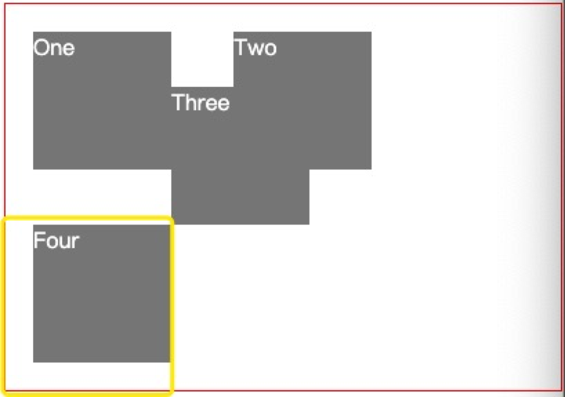
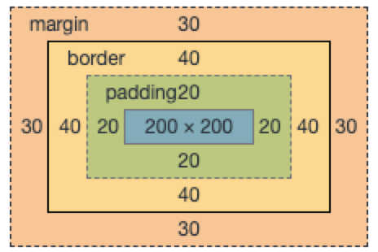
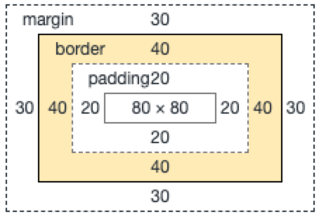

# 十一、你不知道的CSS

## 1、position 属性值及其用法

### static 

position 的默认值，不设定任何定位方式即为该值。此时 top、left、z-index 等各种定位属性不起作用。

### relative

相对定位，设置该值的元素不会脱离文档流，相对于元素本来的位置进行定位。该值对 table-* 一类的元素没有作用。<b>脱离文档流的意思是该元素偏离了位置之后别的元素会占据它原来的空间。</b>

HTML 
```
  <div class="box" id="one">One</div>
  <div class="box" id="two">Two</div>
  <div class="box" id="three">Three</div>
  <div class="box" id="four">Four</div>

```
CSS
```
  .box { 
    display: inline-block; 
    background: red; 
    width: 100px; 
    height: 100px; 
    margin: 20px; 
    color: white; 
  }

  #three { 
    position: relative; 
    top: 10px; 
    left: 50px; 
    z-index: -50;
    width: 100px;
    height: 100px;
  }
```



position的值为 relative 的元素不会脱离文档流，后继元素也不会占据它的位置。

### absolute 

相对于最近一级的且 position 的值不是 static 的祖先元素进行定位。且设置该值的元素会脱离文档流，如果不存在这这样的祖先元素，那么就相对于 <b>body</b> 元素进行定位。

HTML

```
  div class="con">
    <div class="box" id="one">One</div>
    <div class="box" id="two">Two</div>
    <div class="box" id="three">Three</div>
    <div class="box" id="four">Four</div>
  </div>
```
CSS

```
  .con {
    margin-left: 80px;
    position: relative;
  }
  .box { 
    display: inline-block; 
    background: grey; 
    width: 100px; 
    height: 100px; 
    margin: 20px; 
    color: white; 
  }
  #three { 
    position: absolute; 
    top: 100px; 
    left: -100px; 
    z-index: -50;
    width: 100px;
    height: 100px;
  }
```


position 为 absolute 的元素会脱离文档流，其他元素会挤占它的位置。且相对于不是 static 的祖先元素定位。

### fixed

相对于视口进行定位，元素会被移除正常的文档流, 并且随着视口的滚动元素位置也不会发生变化。相对于浏览器窗口定位是不准确的，因为当祖先元素的 transform，perspective 或者 filter 属性非 none 的时候，视口改为祖先。

#### 相对于屏幕视口定位

HTML
```
  <div class="con">
    <div class="box" id="one">One</div>
    <div class="box" id="two">Two</div>
    <div class="box" id="three">Three</div>
    <div class="box" id="four">Four</div>
  </div>
```

CSS
```
  .con {
    margin-left: 80px;
    position: relative;
  }
  .box { 
    display: inline-block; 
    background: grey; 
    width: 100px; 
    height: 100px; 
    margin: 20px; 
    color: white; 
  }
  #three { 
    position: fixed; 
    bottom: 100px; 
    left: 100px; 
    z-index: -50;
    width: 100px;
    height: 100px;
  }
```


随着视口的放大和缩小，红圈圈出来的地方大小是不变的。

#### 相对于父级元素定位

HTML
```
  <div class="con">
    <div class="box" id="one">One</div>
    <div class="box" id="two">Two</div>
    <div class="box" id="three">Three</div>
    <div class="box" id="four">Four</div>
  </div>
```

CSS
```
  .con {
    margin-left: 80px;
    position: relative;
    transform: scale(1);
    border: 1px solid red;
  }
  .box { 
    display: inline-block; 
    background: grey; 
    width: 100px; 
    height: 100px; 
    margin: 20px; 
    color: white; 
  }

  #three { 
    position: fixed; 
    bottom: 100px; 
    left: 100px; 
    z-index: -50;
    width: 100px;
    height: 100px;
  }
```


由于父级元素 transform 属性不为 none，所以 .three 元素相对于父级元素 fixed 定位。图示中黄色区域大小不会发生改变。

### sticky

粘性定位，相对于最近一级的滚动祖先和块级元素进行定位。它会定义一个阈值，在该阈值之内表现为 releative 定位，在这置位之外为固定定位 fixed。

```
  #one { position: sticky; top: 10px; }
```
在 viewport 视口滚动到元素 top 距离小于 10px 之前，元素为相对定位。之后，元素将固定在与顶部距离 10px 的位置，直到 viewport 视口回滚到阈值以下。当其父元素不在视窗内时item元素失去粘性效果。这一点与fixed的表现不同。fixed定位元素是相对于整个视窗定位。

## 2、CSS 盒模型

有两种盒模型，W3C 标准盒模型 content-box， IE 盒模型 border-box。

浏览器默认的是 content-box 标准盒模型。

盒模型包分为内容（content）、填充（padding）、边界（margin）、边框（border）四个部分。

W3C 标准盒模型： 元素设置的 width、height 即为 content 的宽高，不包含 border 和 padding。

IE 盒模型：元素的 width、height 包含 content、padding 和 border。

盒模型可以通过 CSS 的 box-sizing 属性设置。

HTML（默认 W3C 标准盒模型）:
```
  <div class="con"></div>
  .con {
    width: 200px;
    height: 200px;
    background-color: red;
    padding: 20px;
    border: 40px solid brown;
    margin: 30px;
  }
```


标准盒模型 content 的宽高即为设置的 width（200），height(200)

HTML（IE盒模型）:
```
  <div class="con"></div>
  .con {
    width: 200px;
    height: 200px;
    background-color: red;
    padding: 20px;
    border: 40px solid brown;
    margin: 30px;
    box-sizing: border-box;
  }
```


手动设置盒模型为 border-box。元素的宽高即为 content(80) + border(40 * 2) + padding(20 * 2) = width (200)

content的宽高会根据设置的 width 、border、padding 动态设置。
